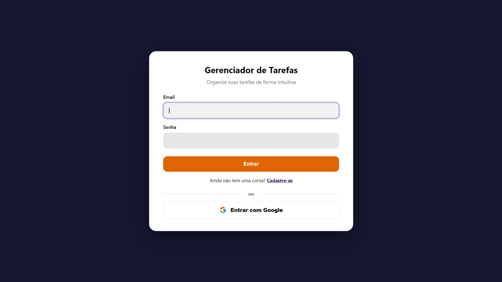
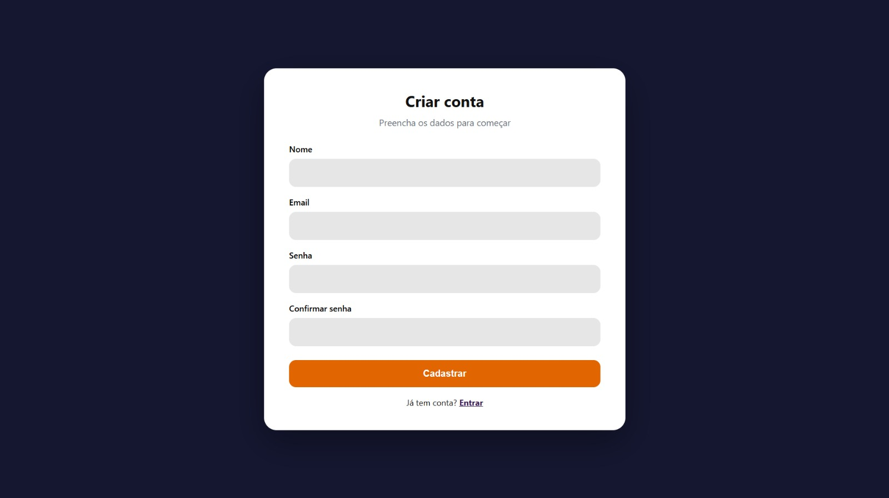
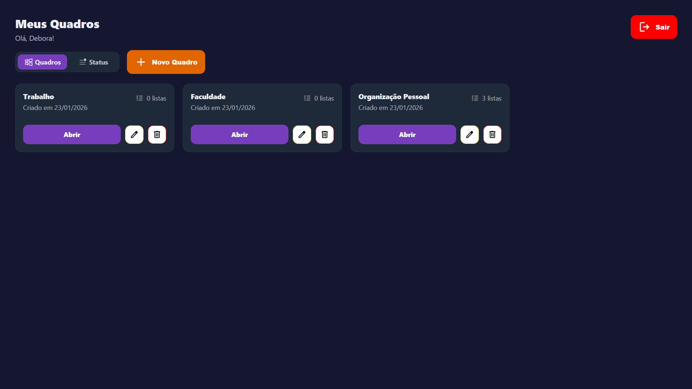
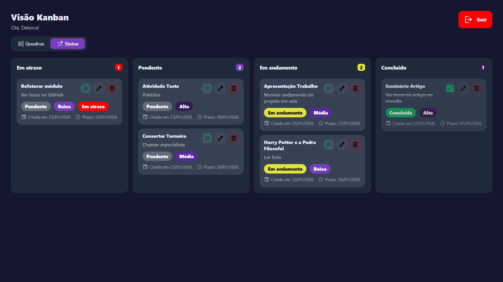
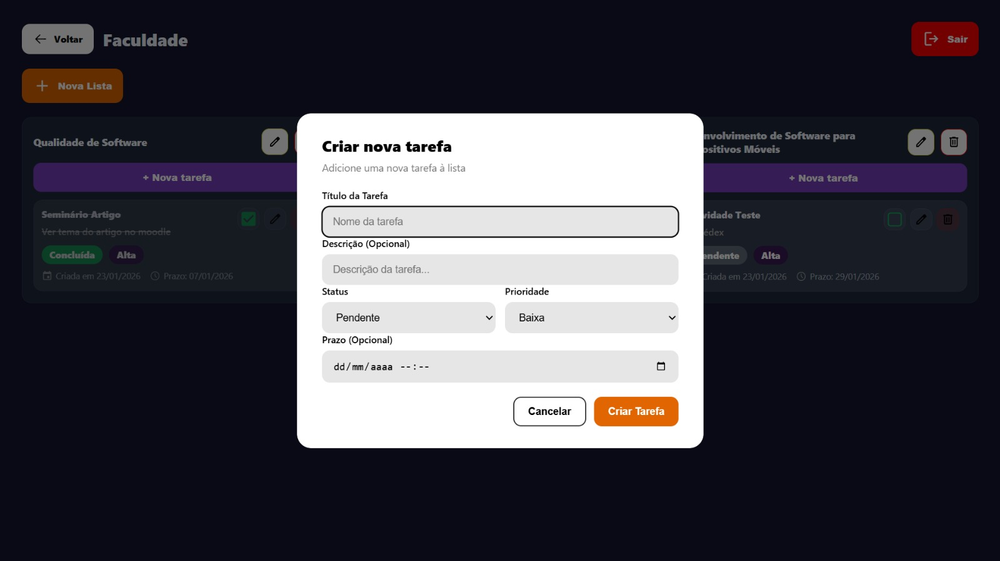

# ✅ Gerenciador de Tarefas

Aplicação web desenvolvida em **Ruby on Rails** para organização de tarefas em quadros e listas, com visual estilo Kanban, autenticação segura e integração com o **Google Agenda** para sincronização de prazos.

---

## 📖 Visão Geral

O sistema permite que usuários organizem suas tarefas de forma simples e visual, criando quadros, listas e tarefas com prazos, prioridades e status.  
Tarefas com prazo podem ser automaticamente sincronizadas com o Google Agenda.

---

## 🚀 Tecnologias Utilizadas

- Ruby 3.3.10  
- Rails 8.1.2  
- PostgreSQL  
- Hotwire (Turbo)  
- Devise (autenticação)  
- OmniAuth Google OAuth2  
- Google Calendar API  
- Docker  

---

## ✨ Funcionalidades

- Autenticação com e-mail/senha e Google
- Criação e gerenciamento de quadros e listas
- Criação de tarefas com:
  - Status (pendente, em andamento, concluída)
  - Prioridade (baixa, média, alta)
  - Prazo (data e hora)
- Identificação de tarefas em atraso
- Visualização por quadros ou por status (Kanban)
- Integração com Google Agenda

---

## 🗂️ Modelagem

- **User**
  - has_many :boards
  - has_many :lists, through: :boards
  - has_many :tasks, through: :lists

- **Board**
  - belongs_to :user
  - has_many :lists

- **List**
  - belongs_to :board
  - has_many :tasks

- **Task**
  - belongs_to :list
  - Atributos: title, description, due_date, status, priority, completed_at

---

## ⚙️ Executando Localmente

### Sem Docker
```bash
bundle install
rails db:create db:migrate
rails s
```

### Com Docker
```bash
docker compose build
docker compose up
```

Acesse: http://localhost:3000

## 🔐 Variáveis de Ambiente

### Autenticação (exemplo)
- GOOGLE_CLIENT_ID=
- GOOGLE_CLIENT_SECRET=

### Banco de dados (PostgreSQL local)
- POSTGRES_HOST=127.0.0.1
- POSTGRES_PORT=5432
- POSTGRES_USER=postgres
- POSTGRES_PASSWORD=SEU_PASSWORD

### Ambiente
- RAILS_ENV=development

## Telas do Sistema







